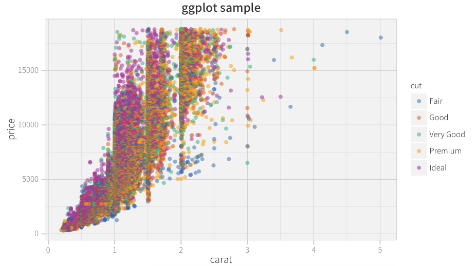

# Dependencies

* [jvgrep](https://github.com/mattn/jvgrep/releases) for vim grep.
* [Cica fonts](http://sv.btnb.jp/cica-font) for gvim.
* [Noto Sans CJK JP](https://www.google.com/get/noto/#/family/noto-sans-jpan) for ggplot.

## for Windows

* [DiffUtils](http://gnuwin32.sourceforge.net/packages/diffutils.htm) for vim diff.

### if can not install fonts...

```vim
" .gvimrc
guifont=Consolas:h9
guifontwide=MS_Gothic
printfont=Consolas:h9
```

# R ggplot sample

```r
 ggplot(diamonds,aes(x=carat,y=price,colour=cut)) +
     geom_point(alpha=0.5) +
     my_ggtheme() +
     scale_color_manual(values=univ_colors) +
     ggtitle("ggplot sample")
```


